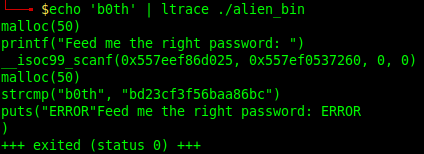

# alien_bin // Writeup

## Problem

*In the ruins of an ancient alien civilization a micro sd card was found with this binary inside. It's asking us to feed it a password, but we don't know where to get it from! We've tried all of our birthdays right way and backwards here at the lab, but nothing seems to work :( Maybe we missed something.*

## Solution

The problem was easier than expected , i solved it with `ltrace` :

And we can directly see the pass : **`bd23cf3f56baa86bc`**.

I think you can patch it too.
