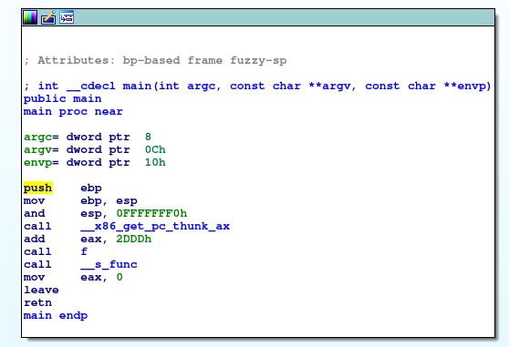

# iso_32 // Writeup

## Problem

*a 32bit elf crackme
try to solve it :)*

## Solution(s)

In `main` , we can see it calls **`__f_func`** function after calling **`f`**.

By disassembling the ELF we see a **`__s_fun`** function that return `Great !!`.

So we want to call this function :

- You can patch it using **IDA**:

 

- You ou can use **gdb** to break at `0x080491ad` (__f_func)  and jump to `0x08049182` (__s_func)

- I have made a payload to take **eip** control:

```python
from pwn import *
payload='A'*44
payload+=p32(0x8049182)
print payload
```
`AAAAAAAAAAAAAAAAAAAAAAAAAAAAAAAAAAAAAAAAAAAA\x82\x91\x04`

```
# python exploit.py | ./crackme 
enter the password:Great !!
Erreur de segmentation
```

