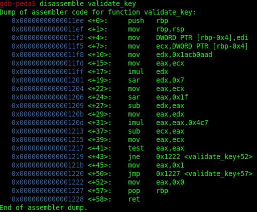

# keyg3nme // Writeup

## Problem

*easy, you just need to figure out the logic behind key validation. this should be fairly easy even with an ugly debugger. i'm new here, so the difficulty ranking could be a little off.*

## Solution

`keyg3nme: ELF 64-bit LSB pie executable, x86-64, version 1 (SYSV), dynamically linked, interpreter /lib64/ld-linux-x86-64.so.2, BuildID[sha1]=01d8f2eefa63ea2a9dc6f6ceb2be2eac2ca22a67, for GNU/Linux 3.2.0, not stripped`

The easiest way is to patch it , but we are going to debug it with `gdb` and disassemble it.

The file isnt stripped so if you disassemble it you should see symbols. There is **`main`** and another interesting function : **`validate_key`**

Lets disassemble it before doing `set disassembly-flavor intel`.

We can see directly the key : **`0x4c7`**

But i have done it with a different way , i have set `eax` to 0 at `0x1217` , `set $eax = 0`.

You can patch the **`jne`** too.
