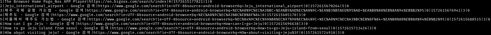

# Contact point // Writeup

## Problem

*경찰의 수사 끝에 마약을 사려는 구매자를 잡았다. 마약 구매자와 함께 마약 판매상을 잡으려는데, 구매자가 접선장소를 말하지 않는다. 이 사람의 스마트폰을 압수하였는데, 과연 접선지를 알아낼 수 있을까? Flag포맷: KorNewbie{접선지} <뛰어쓰기는 _로 대체하세요>*

*After a police investigation, he caught a buyer trying to buy drugs. You try to catch a drug dealer with a drug buyer, but the buyer doesn't say where you are meeting. If you seized this man's smartphone, can you find out where it is? Flag Format: KorNewbie{Contact point}*

Author: 신재욱(Y311J)

## Solution

[backup.ab](https://nctf.vulnerable.kr/files/ce713e6aa25621e1de8d6745cf41c69e/backup.ab?token=eyJ0ZWFtX2lkIjoyMTYsInVzZXJfaWQiOjU1NSwiZmlsZV9pZCI6MzF9.XcN3Zg.WpXr3mBwkeEUq4nmdfYXyx899qk) is an android backup file.

To extract it, we will use abe ( android backup extractor ) 

`java -jar abe.jar unpack backup.ab backup.tar ''` , `''` is to say we don't want password ( to encrypt ).

Personally i have unpacked the file like this : `dd if=backup.ab bs=24 skip=1 | zlib-flate -uncompress > backup.tar`, but it's simpler with abe.

Now we have a `.tar` compressed file, we have to extract content from that archive : `tar -xvf backup.tar`.

This will give us the `apps/` folder where a lot of data is stored. But the most interesting thing is `com.android.browser/`.

**In which there is a database with the desired location.**

So open `browser2.db` with sqlite3 for example and use the following command : `SELECT * FROM history ;`. 

We have found the contact point : `Jeju_international_airport`

**FLAG** : `KorNewbie{Jeju_international_airport}`
