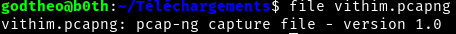
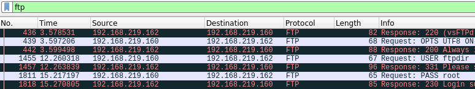
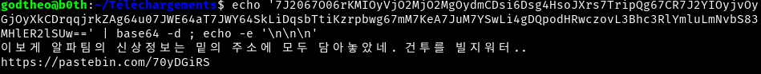
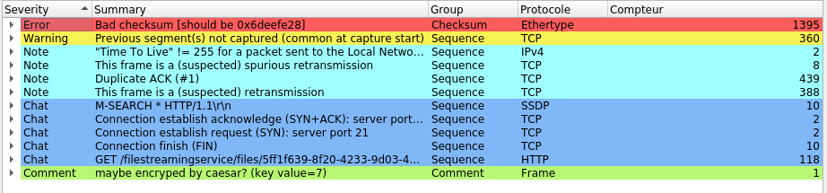

# Find The Plain // Writeup

## Problem

*== KR == 알파팀의 내부고발자가 팀 내부 기밀자료를 ftp를 이용하여 외부로 내부의 정보를 유출시키는 패킷을 캡쳐하였다.*

*패킷을 분석하여 ftp접속에 사용된 비밀번호와 획득한 정보를 플래그로 제출하라!*

*플래그 형식 : KorNewbie{비밀번호_발견한정보}*

*※ 혹시라도 해시값이 있다면 그것은 md5이다.*

*== EN == Alpha team's whistleblower captured a packet that leaked internal information to the outside using ftp internal confidential data.*

*Analyze the packet and flag the password and information obtained for the ftp connection!*

*flag format : KorNewbie{password_yougetinformation}*

*※ If there is a hash value, it will be md5.*

Author: 신재욱(Y311J)

## Solution

Checking file type,

Open [vithim.pcapng](https://nctf.vulnerable.kr/files/e9f451a2239ca6d6a4555ae7a3a0c64c/vithim.pcapng?token=eyJ0ZWFtX2lkIjoyMTYsInVzZXJfaWQiOjU1NSwiZmlsZV9pZCI6MTl9.XcNOHg.-o6zY1_kncoKP70PG_KWHBQ91Jw) ( dumped network traffic ) with Wireshark and use filter `ftp`.

As we can see it's not really useful to inspect stream because we see pass in the payload, `pass = root`

After finding the pass, we need more information so we are going to inspect `ftp-data`.

There is only one packet who use that protocol and the data is an encoded base64 message :

`7J2067O06rKMIOyVjO2MjO2MgOydmCDsi6Dsg4HsoJXrs7TripQg67CR7J2YIOyjvOyGjOyXkCDrqqjrkZAg64u07JWE64aT7JWY64SkLiDqsbTtiKzrpbwg67mM7KeA7JuM7YSwLi4gDQpodHRwczovL3Bhc3RlYmluLmNvbS83MHlER2lSUw==`.

Now we have a link for a pastbin, that link give us something that looks like hashed `k459iki6m5j094m2lmkhjmi9527l81ml`

As the problem said we need a md5 format and we have this important information :

Now we know `k459iki6m5j094m2lmkhjmi9527l81ml` is encrypted with rot algorithm with key = 7.

So we have to decrypt it `26 - 7 = 19` so we can decrypt it with key = 19.

We got `d459bdb6f5c094f2efdacfb9527e81fe` who is a md5 hash for `The new boss is IronDragon`.

**FLAG** : `KorNewbie{root_IronDragon}`
