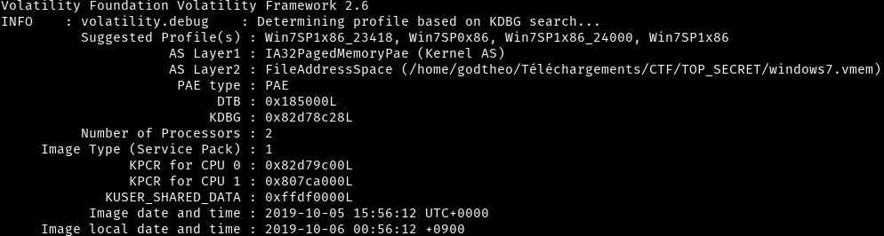
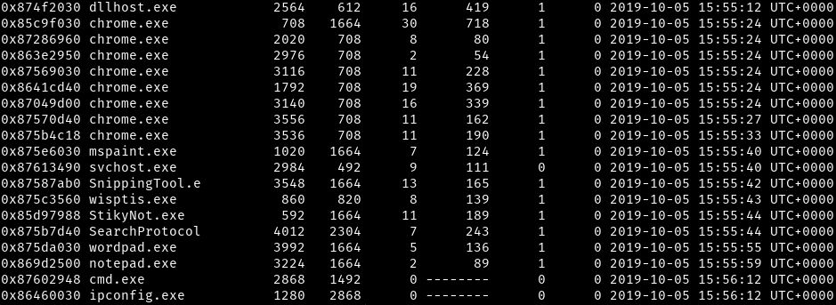

# Top Secret // Writeup

## Problem

*적국의 일급 기밀이 담긴 가상머신 파일을 탈취하였다. 그러나, USB 메모리의 용량 부족으로 어쩔 수 없이 제일 중요해보이는 메모리만 덤프해 신속하게 현장을 탈출하였다. 적국의 기밀은 무엇인가? (Fake Flag파일이 존재합니다.)*

*He stole the virtual machine file containing the top secret of the enemy country. However, due to the shortage of USB memory, I dumped only the memory that seemed to be the most important. What is the secret of an enemy country? (Fake Flag file exists.)*

Author: 신재욱(Y311J)

## Solutions

### Hardest method

[Windows 7 Enterprise K-b94208dd.vmem](http://web.jaeuk.xyz/Top_Secret/NewbieCTF2019_Top_Secret.zip) is a virtual memory file.

So we are going to use **volatility**, a useful tool in forensics analysis.
The file name does not give us enough information, so we'll go find it ourselves ( file name changed to `windows7.vmem` ) : 

`volatility -f windows7.vmem imageinfo`

We now have the profile : `Win7SP1x86`. Let's dump the processes who were running :

`volatility -f windows7.vmem --profile=Win7SP1x86 pslist`

There is a lot of interesting processes like `chrome.exe` , `notepad.exe` or `mspaint.exe`. Let's dump one of them like `mspaint.exe`. His pid is `1020` :

`volatility -f windows7.vmem --profile=Win7SP1x86 procdump -p 1020 --dump-dir=$PWD`

The file output name is `1020.dmp` , let's get the printable characters sequence `strings 1020.dmp | grep KorNewbie{.*}`.

### Easiest method

`strings windows7.vmem | grep KorNewbie{.*}`

**FLAG**: `KorNewbie{OH..You_Know_B4sic_0F_M3mory_Forensics!}`
