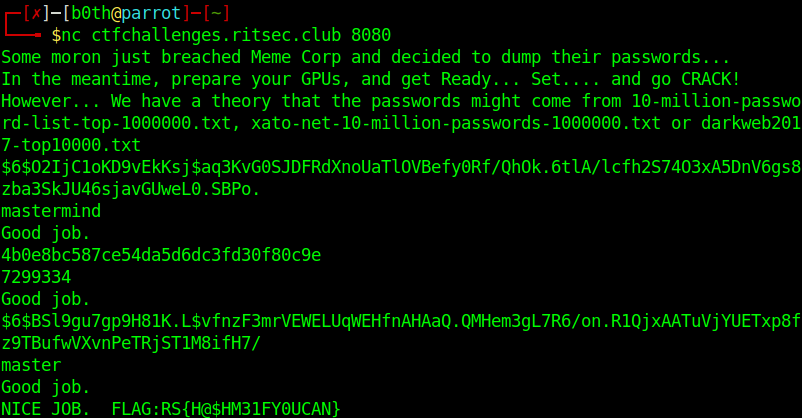

# Crack me If You Can // Writeup

## Problem

*Rev up your GPUs...*

*nc ctfchallenges.ritsec.club 8080*

*Flag format RS{ }*

Author: Sp1kedshell

## Solution

Connect to the given ip with netcat : `nc ctfchallenges.ritsec.club 8080`. It will return hashes, let's decrypt them with hashcat.

Hash type | hashcat --hash-type | Hash
--------|----------|------------
sha512crypt | 1800 |$6$O2IjC1oKD9vEkKsj$aq3KvG0SJDFRdXnoUaTlOVBefy0Rf/QhOk.6tlA/lcfh2S74O3xA5DnV6gs8zba3SkJU46sjavGUweL0.SBPo.
NTLM | 1000 | 4b0e8bc587ce54da5d6dc3fd30f80c9e
sha512crypt | 1800 | $6$BSl9gu7gp9H81K.L$vfnzF3mrVEWELUqWEHfnAHAaQ.QMHem3gL7R6/on.R1QjxAATuVjYUETxp8fz9TBufwVXvnPeTRjST1M8ifH7/

**FLAG**: `FLAG:RS{H@$HM31FY0UCAN}`

