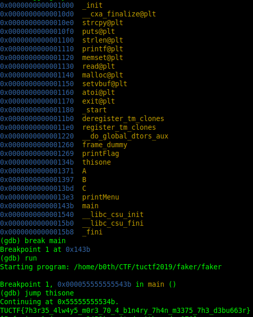

# faker // Writeup

## Problem

*One of these things is not like the other. Can you uncover the flag ?*

## Solution

Use gdb on faker, `info functions` and you will see `thisone`. Go to that function and get the flag.

