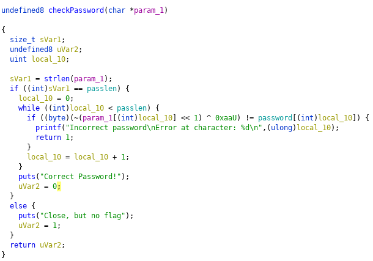

# object // Writeup

## Problem

## Solution

We have an object file and in this method we are going to compile it.

`run.o: ELF 64-bit LSB relocatable, x86-64, version 1 (SYSV), not stripped`

To compile it : `gcc run.o -o run_binary`

After compiling, I disassembled and decompiled it with ghidra and i saw there was an interesting function : `checkPassword`.



Obviously, this is the only one function called in main. So that function tell us, it will return `Incorrect password`.. only if the password len is right. So we need to find the len first. To do that you can bruteforce it with a program or check the password array in the disassembler , if you check into the disasembler dont forget to dont count the null value.

Correct lenght : `44`

After i just ran a program i made : 

```python
import os
import subprocess

list_ascii = list('abcdefghijklmnopqrstuvwxyABCDEFGHIJKLMNOPQR=STUV_WYZ01!?.:}{23456789')
password = 'a'*44
arr = list(password)

while True:
    for char in list_ascii:

        run =  subprocess.Popen('echo %s | ./run_binary' % (''.join(arr)) , shell=True, stdout=subprocess.PIPE).stdout

        byte_output = run.read()
        string_output = byte_output.decode()

        if 'Incorrect' in  str(string_output):
            number = int(string_output[108:])
            arr[number] = char

    if 'Correct' in str(string_output):
        print(''.join(arr))
        break
```

**FLAG**: `TUCTF{c0n6r47ul4710n5_0n_br34k1n6_7h15_fl46}`

